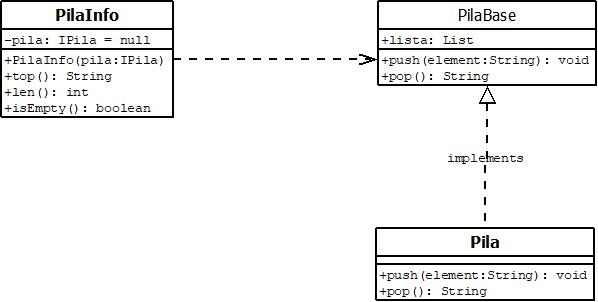

## Stack Example with good practices

This is an attempt for making a simulation of a stack structure.
I don't pretend to do it from scratch but to use good design principles.
The main purpose of this exercise is learning about clean code and good design principles.

Any advice or PR are welcome.

- Class Diagram

